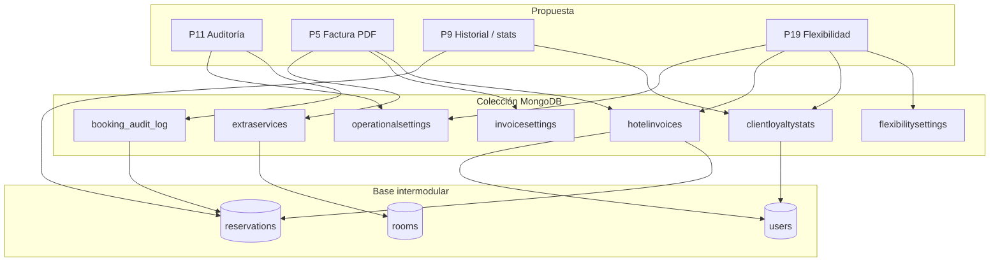

# API — Propuestas P11, P5, P9 y P19

Documentación de la API para las cuatro propuestas implementadas en el Proyecto Individual. El resto del sistema (auth, usuarios, habitaciones CRUD, reseñas, mailer, etc.) corresponde al proyecto intermodular base.

Clientes: [WPF](../WPF-Intermodular-Ysael/README.md) · [Android](../APP-Intermodular-Ysael/README.md)

---

## Modelos MongoDB (colecciones nuevas)

En Compass verás **siete colecciones** creadas para las propuestas (además de `users`, `rooms` y `reservations` del proyecto base). Cada una tiene un modelo Mongoose en `models/` y un servicio que define **cuándo** se lee o escribe.



| Colección | Modelo | Propuesta | Documentos |
|-----------|--------|-----------|------------|
| `booking_audit_log` | `BookingAuditLog` | **P11** | Muchos (uno por evento) |
| `hotelinvoices` | `HotelInvoice` | **P5** (+ cargos P19) | Muchos (varios por reserva posible) |
| `invoicesettings` | `InvoiceSettings` | **P5** | **Uno** (config global) |
| `clientloyaltystats` | `ClientLoyaltyStats` | **P9** (+ lectura **P19**) | **Uno por** `user_id` |
| `flexibilitysettings` | `FlexibilitySettings` | **P19** | **Uno** (config global) |
| `operationalsettings` | `OperationalSettings` | **P11** + **P19** (cliente) | **Uno** (config global) |
| `extraservices` | `ExtraService` | **P5** (líneas en PDF) | Catálogo (`EXT-001`, …) |

Los campos P19 (`early_checkin_requested`, `late_checkout_requested`) **no** tienen colección propia: viven **embebidos** en cada documento de `reservations`.

---

### `booking_audit_log` — P11

**Archivo:** `models/BookingAuditLog.js` · **Servicio:** `services/auditService.js`

**Funcionamiento:**

1. Llega una petición que modifica una reserva (p. ej. `PATCH /reservation/update`).
2. `bookingAuditMiddleware` lee la reserva actual y guarda copia en memoria (`previous_state` pendiente).
3. El controlador guarda el cambio en `reservations`.
4. Si `operationalsettings.booking_audit_enabled` es `true`, `logBookingChange()` **inserta** un documento en `booking_audit_log` con el par antes/después.
5. Los `GET` de auditoría **solo leen** esta colección; nunca actualizan ni borran filas.

| Campo | Rol |
|-------|-----|
| `booking_id` | Enlaza con `reservations.reservation_id` (`RSV-xxxxx`) |
| `action` | `CREATED` \| `UPDATED` \| `CANCELED` |
| `actor_id` / `actor_type` | Quién actuó (`user` = cliente, `employee` = staff) |
| `previous_state` / `new_state` | JSON completo de la reserva en ese instante |
| `timestamp` | Orden cronológico (índice con `booking_id`) |

**Respuesta enriquecida:** `describeReservationAuditChanges()` compara los dos JSON al consultar y devuelve `resumen_cambios` + `detalle_cambios` sin guardarlos en Mongo.

---

### `operationalsettings` — P11 y P19 (cliente)

**Archivo:** `models/OperationalSettings.js` · **Servicio:** `services/operationalSettingsService.js`

Documento **único** (`key: hotel_operational`). WPF lo edita con `PUT /settings/operational`.

| Campo | Función |
|-------|---------|
| `booking_audit_enabled` | Si `false`, el paso 4 de `booking_audit_log` no inserta (ahorra escrituras; el histórico antiguo sigue visible). |
| `client_flex_request_window_hours` | Tras las **11:00** del día de salida, el huésped en Android solo puede pedir salida tardía o ampliación corta durante esas horas (por defecto **12**). Recepción no usa este límite. |

Fallback: variables `.env` `BOOKING_AUDIT_ENABLED` y `CLIENT_FLEX_REQUEST_WINDOW_HOURS` si el documento no existe.

---

### `hotelinvoices` — P5 (y suplementos P19)

**Archivo:** `models/HotelInvoice.js` · **Servicio:** `services/invoiceEmissionService.js`

**Por qué existe:** además de copiar `invoice_number` en `reservations` al hacer checkout, cada **emisión** (estancia, check-in anticipado, salida tardía, ampliación) queda como fila histórica para listados y PDF por número.

| Campo | Función |
|-------|-----|
| `invoice_number` | Único en toda la BD (misma numeración que checkout) |
| `reservation_id` | Reserva principal `RSV-xxxxx` |
| `user_id` / `room_id` | Huésped y habitación en el momento de emisión |
| `type` | `reservation` \| `early_checkin` \| `late_checkout` \| `stay_extension` |
| `amount` | Importe TTC del concepto |
| `description` | Texto legible en listados |
| `invoice_breakdown` | Desglose opcional congelado para ese PDF |
| `linked_reservation_id` | Si una ampliación creó otra RSV |
| `issued_at` | Fecha de emisión |

**Cuándo se crea un documento:**

| Evento | `type` típico |
|--------|----------------|
| Checkout recepción | `reservation` (también en `reservations.invoice_number`) |
| Pago simulado app (`confirm-payment`) | `reservation` |
| P19 aprobado con cargo | `early_checkin` o `late_checkout` |
| Ampliación de estancia con suplemento | `stay_extension` |

`GET /invoices?userId=` y `GET /reservation/invoices/history` leen **esta** colección.

---

### `invoicesettings` — P5

**Archivo:** `models/InvoiceSettings.js` · **Servicio:** `services/invoiceSettingsService.js`

Documento **único** (`key: hotel_invoice_defaults`). Al generar el PDF, `invoicePdfService` llama a `getMergedHotelInvoiceDisplay()`: valores en Mongo **primero**; si un campo está vacío, usa `.env` (`HOTEL_INVOICE_NAME`, `HOTEL_INVOICE_CIF`, …).

| Campo | Aparece en PDF como |
|-------|---------------------|
| `hotel_commercial_name` | Nombre del emisor |
| `hotel_cif` | NIF/CIF |
| `hotel_address` | Dirección fiscal |
| `fiscal_notes` | Pie legal opcional |
| `iva_rate` | Tipo de IVA (si `null`, solo `.env` `INVOICE_IVA_RATE`) |

WPF **Datos factura** → `GET/PUT /settings/invoice`.

---

### `extraservices` — P5 (desglose de factura)

**Archivo:** `models/ExtraService.js` · **Controlador:** `controllers/extraServiceController.js`

Catálogo reutilizable: TV, cuna, desayuno, etc. Cada habitación en `rooms` guarda en `extra_services[]` los IDs que ofrece (`EXT-001`, …).

| Campo | Función |
|-------|-----|
| `service_id` | Clave única generada al crear (`EXT-xxx`) |
| `name` | Nombre en catálogo y en PDF |
| `price` | Precio TTC por unidad en factura (`0` = línea sin cargo explícito) |
| `active` | Si `false`, no sale en `GET /room/extra-services` |

**Flujo P5:** en checkout, `invoiceBreakdownService` lee los IDs de la habitación, busca precios en `extraservices` y arma las líneas del PDF junto al alojamiento y descuentos.

---

### `clientloyaltystats` — P9 y P19

**Archivo:** `models/ClientLoyaltyStats.js` · **Servicio:** `services/clientLoyaltyStatsService.js`

**Un documento por cliente** (`user_id` único `CLI-xxxxx`). No sustituye a `users`: es una **caché agregada** recalculada desde `reservations`.

| Campo | Origen / uso |
|-------|----------------|
| `loyalty_tier` | `bronze` \| `silver` \| `gold` según noches y gasto (`LOYALTY_*` en `.env`) |
| `total_nights` | Suma noches de reservas no canceladas |
| `total_spent` | Suma de `price` de esas reservas |
| `completed_stays_count` | Estancias con checkout o `check_out` pasado |
| `last_stay_checkout_at` | Última salida completada |

**P9:** `GET /loyalty/me` recalcula, hace **upsert** aquí y devuelve JSON a Android (Estadísticas). `GET /users/:id/stats` usa reservas + este doc para insights.

**P19:** `flexibilityProgramService` lee `loyalty_tier` para decidir auto-aprobación (plata/oro) y % de descuento sobre el suplemento horario.

---

### `flexibilitysettings` — P19

**Archivo:** `models/FlexibilitySettings.js` · **Servicio:** `services/flexibilitySettingsService.js`

Documento **único** (`key: hotel_flexibility_pricing`). Define las reglas que aplican a **todas** las solicitudes early/late. Si un campo es `null` en Mongo, se usa el fallback `.env` (`FLEX_EARLY_RATE_PER_HOUR`, etc.).

| Campo | Función en la lógica |
|-------|----------------------|
| `early_checkin_rate_per_hour` / `late_checkout_rate_per_hour` | € por hora de diferencia vs 12:00 / 11:00 |
| `min_billable_hours` | Mínimo de horas a cobrar |
| `max_supplement_eur` | Tope del suplemento (0 = sin tope) |
| `free_access_tiers` | Rangos con suplemento 0 € (p. ej. `gold`) |
| `discount_*_percent` | Descuento sobre suplemento por bronce/plata/oro |
| `early_min_hour` / `late_max_hour` | Ventana horaria permitida el mismo día |
| `max_early_hours` / `max_late_hours` | Límite de horas de adelanto/retraso |
| `notify_client_on_decision` | Activa email SMTP al aprobar/rechazar |

WPF **Reglas solicitudes** → `GET/PUT /settings/flexibility`.

**Flujo P19 resumido:**

1. Cliente o recepción llama `PATCH /bookings/:id/request-*`.
2. Servicio lee `flexibilitysettings` + `clientloyaltystats` + disponibilidad en `reservations` vecinas.
3. Actualiza subdocumentos en **`reservations`** (`early_checkin_requested` / `late_checkout_requested`).
4. Si hay cargo y queda aprobado → `emitHotelInvoice` → fila en **`hotelinvoices`**.

---

## P11 · Auditoría completa de cambios en la reserva

Cada acción relevante sobre una reserva queda registrada en un log **solo lectura** (no hay endpoints de edición ni borrado del historial).

> Modelo y flujo de escritura: ver [`booking_audit_log`](#booking_audit_log--p11) y [`operationalsettings`](#operationalsettings--p11-y-p19-cliente).

### Middleware de auditoría

`middleware/bookingAuditMiddleware.js` intercepta la petición **antes** del controlador y guarda una copia del documento actual en `req.bookingAuditPreviousState`. Tras un guardado exitoso, `services/auditService.js` → `logBookingChange()` inserta la fila.

**Rutas que generan log** (si la auditoría está activada):

| Ruta | `action` |
|------|----------|
| `POST /reservation/add` | `CREATED` |
| `PATCH /reservation/update` | `UPDATED` |
| `POST /reservation/cancel` · `DELETE /reservation/cancel/:id` | `CANCELED` |
| `POST /reservation/checkout` | `UPDATED` (asignación de factura y cierre) |
| `POST /reservation/check-in` | `UPDATED` (check-in en recepción) |

La escritura puede desactivarse con `booking_audit_enabled` en `operationalsettings` o `BOOKING_AUDIT_ENABLED` en `.env`. Si está desactivada, las reservas siguen funcionando pero no se insertan nuevas líneas.

### Endpoints (solo lectura)

| Método | Ruta | Función |
|--------|------|---------|
| `GET` | `/reservation/:reservation_id/audit` | Historial **cronológico** de una reserva. El cliente solo ve las suyas; admin/empleado ve cualquiera. Cada ítem incluye `resumen_cambios` (texto) y `detalle_cambios` (array `campo`, `etiqueta`, `antes`, `despues`) calculados al vuelo comparando `previous_state` y `new_state`. |
| `GET` | `/reservation/audits` | Mismo formato para **todas** las reservas (solo admin/empleado). |

> La propuesta cita `GET /bookings/:id/audit`. En esta implementación el historial está en `/reservation/:reservation_id/audit` (`:id` = `RSV-xxxxx`). No existe ruta de modificación ni borrado del log.

**Archivos:** `models/BookingAuditLog.js`, `middleware/bookingAuditMiddleware.js`, `services/auditService.js`, `controllers/auditController.js`.

---

## P5 · Factura en PDF descargable

Factura fiscal completa en PDF, generada al vuelo con **pdfkit** (no se guarda el archivo en disco en el servidor).

> Colecciones implicadas: [`hotelinvoices`](#hotelinvoices--p5-y-suplementos-p19), [`invoicesettings`](#invoicesettings--p5), [`extraservices`](#extraservices--p5-desglose-de-factura). Copia en reserva: `reservations.invoice_number` + `invoice_breakdown`.

### Campos en la reserva

| Campo | Cuándo se rellena |
|-------|-------------------|
| `invoice_number` | En `POST /reservation/checkout` (recepción). Formato configurable vía `.env` (`INVOICE_NUMBER_*`, por defecto `FAC-AAAA-NNNN`). |
| `checkout_completed_at` | Misma operación de checkout |
| `invoice_breakdown` | Desglose congelado: noches, alojamiento, oferta habitación, descuento cliente, extras, IVA, total TTC |

La numeración es automática: siguiente secuencial por año/patrón configurado, con índice único en `invoice_number`.

### Endpoints

| Método | Ruta | Función |
|--------|------|---------|
| `POST` | `/reservation/checkout` | Cierra la estancia y **asigna** `invoice_number` + `invoice_breakdown`. Solo admin/empleado. Requiere que la fecha de salida ya haya pasado. |
| `GET` | `/reservation/:reservation_id/invoice` | Genera y devuelve el **PDF de factura** (`application/pdf`). Incluye datos del hotel (`.env` + `InvoiceSettings`), cliente (DNI; empresa si `billing_company_name` / `billing_company_cif`), estancia, tabla de conceptos, base imponible, IVA y total. Query opcional `?invoice_number=FAC-…` si hay varias facturas asociadas a la misma reserva. |
| `GET` | `/invoices?userId=CLI-xxxxx` | **Historial de facturas** del cliente desde la colección `hotelinvoices` (y sincronización con reservas legacy). El cliente solo puede consultar su propio `userId`. |
| `GET` | `/reservation/invoices/history` | Listado global de facturas emitidas (admin/empleado). |
| `POST` | `/reservation/:reservation_id/invoice/email` | Reenvía el PDF por correo (Nodemailer; requiere SMTP). |
| `GET` | `/settings/invoice` | Lee configuración del encabezado fiscal (nombre hotel, CIF, dirección, IVA). |
| `PUT` | `/settings/invoice` | Guarda overrides en Mongo (`InvoiceSettings`). |

> La propuesta cita `GET /bookings/:id/invoice`. La ruta implementada es `GET /reservation/:reservation_id/invoice`.

**Archivos:** `services/invoicePdfService.js`, `services/invoiceBreakdownService.js`, `services/invoiceNumberService.js`, `controllers/invoiceController.js`, `controllers/reservationController.js` (checkout), `models/HotelInvoice.js`, `models/InvoiceSettings.js`.

---

## P9 · Historial de estancias y estadísticas personales

Permite al huésped (y a recepción sobre un cliente) ver estancias pasadas y métricas agregadas. Complemento en app: `GET /loyalty/me` para rango de fidelidad usado también por P19.

> Modelo agregado: [`clientloyaltystats`](#clientloyaltystats--p9-y-p19). El historial paginado lee directamente **`reservations`** (+ `rooms`, `reviews`); no duplica estancias en otra colección.

### Endpoints de historial y estadísticas

| Método | Ruta | Función |
|--------|------|---------|
| `GET` | `/users/:id/history` | Reservas **paginadas** con datos de habitación, importe (`total_paid`), noches y valoración si existe. Por defecto estancias `completed`. |
| `GET` | `/users/:id/stats` | Totales: noches, gasto, temporada favorita, habitación más reservada, racha máxima, última estancia, etc. |
| `GET` | `/user/:userId/history` | Alias de `history` (mismo handler). |
| `GET` | `/user/:userId/stats` | Alias de `stats`. |
| `GET` | `/loyalty/me` | Cliente autenticado: recalcula y devuelve `loyalty_tier`, `total_nights`, `total_spent`, `completed_stays_count` y umbrales (persistido en `ClientLoyaltyStats`). |
| `GET` | `/loyalty/user/:userId` | Mismas métricas de un cliente (admin/empleado). |

**Autorización:** el cliente solo puede acceder a su propio `:id` / `:userId`; admin y empleado a cualquiera.

### Filtros opcionales (`GET …/history` y `…/stats`)

| Query | Efecto |
|-------|--------|
| `?year=2026` | Estancias con `check_in` en ese año |
| `?room_type=Suite` | Filtra por tipo de habitación (coincidencia parcial en `Room.type`) |
| `?status=completed` | `completed` (defecto), `active`, `cancelled` o `all` |
| `?page=1&limit=10` | Paginación (`limit` máx. 50) |
| `?from=` · `?to=` | Rango de fechas adicional |

**Archivos:** `services/userStayService.js`, `services/clientLoyaltyStatsService.js`, `controllers/userStayController.js`, `controllers/loyaltyStatsController.js`, `routes/usersRoutes.js`, `routes/loyaltyRoutes.js`, `models/ClientLoyaltyStats.js`.

---

## P19 · Check-in anticipado y check-out tardío

Programa de flexibilidad horaria ligado al **nivel de fidelidad** (P9).

> Configuración: [`flexibilitysettings`](#flexibilitysettings--p19). Rango del huésped: [`clientloyaltystats`](#clientloyaltystats--p9-y-p19). Plazo cliente: [`operationalsettings`](#operationalsettings--p11-y-p19-cliente). Estado de cada solicitud: subdocumentos en **`reservations`**. Cargo facturado: [`hotelinvoices`](#hotelinvoices--p5-y-suplementos-p19).

### Campos embebidos en `reservations` (no colección aparte)

| Campo | Descripción |
|-------|-------------|
| `early_checkin_requested` | Objeto o `null`: hora solicitada, `status` (`pending` / `approved` / `rejected`), tarifas, `final_fee`, `auto_approved`, etc. |
| `late_checkout_requested` | Igual para salida después de las 11:00 el **mismo día** de `check_out` |

### Endpoints

| Método | Ruta | Función |
|--------|------|---------|
| `PATCH` | `/bookings/:id/request-early-checkin` | Solicita entrada antes de las 12:00 el día de `check_in`. Body: `{ "requested_time": "ISO" }`. Comprueba disponibilidad de la habitación en la franja. |
| `PATCH` | `/bookings/:id/request-late-checkout` | Solicita salida tardía el día de `check_out`. Body: hora y opcional `"mode": "facilities"`. |
| `GET` | `/bookings/:id/flexibility` | Estado de solicitudes, rango del cliente y vista previa del suplemento (`fee_preview`). |
| `GET` | `/bookings/flexibility/pending` | Cola de solicitudes `pending` del día (recepción). Query `?day=YYYY-MM-DD`. |
| `PATCH` | `/bookings/:id/flexibility/early-checkin/review` | Admin/empleado: aprueba o rechaza; **revalida** disponibilidad al aprobar. |
| `PATCH` | `/bookings/:id/flexibility/late-checkout/review` | Igual para salida tardía. |
| `GET` | `/settings/flexibility` | Lee reglas: €/h, descuentos por rango, niveles con acceso gratuito, auto-aprobación plata/oro. |
| `PUT` | `/settings/flexibility` | Guarda reglas en `FlexibilitySettings`. |

Existen **alias** bajo `/reservation/:reservation_id/…` (mismos controladores).

### Lógica de negocio

1. **Disponibilidad:** si la habitación está ocupada en la franja solicitada → `rejected` (todos los rangos).
2. **Fidelidad** (`ClientLoyaltyStats.loyalty_tier`): **plata** y **oro** → `approved` automático si hay hueco (`auto_approved: true`). **Bronce** → `pending` hasta revisión en WPF.
3. **Suplemento:** horas de diferencia × €/h (configurable); descuento % según rango; mínimo de horas facturables; tope opcional.
4. **Notificación al cliente:** email al aprobar/rechazar si SMTP configurado (`flexibilityNotificationService.js`). Si hay cargo, se puede emitir factura en `hotelinvoices`.

**Archivos:** `controllers/flexibilityController.js`, `services/flexibilityProgramService.js`, `services/flexibilitySettingsService.js`, `services/flexibilityNotificationService.js`, `routes/bookingRoutes.js`.

---

## Variables de entorno (propuestas)

| Variable | Propuesta |
|--------|-----------|
| `BOOKING_AUDIT_ENABLED` | P11 — activar log por defecto |
| `HOTEL_INVOICE_*`, `INVOICE_*`, `INVOICE_IVA_RATE` | P5 — PDF y numeración |
| `LOYALTY_*` | P9 / P19 — umbrales bronce/plata/oro |
| `FLEX_*` | P19 — tarifas €/h y auto-aprobación (fallback si no hay doc en Mongo) |
| `EMAIL_*` | P19 (y reenvío factura P5) — notificaciones por correo |

```bash
npm install && npm start
```
