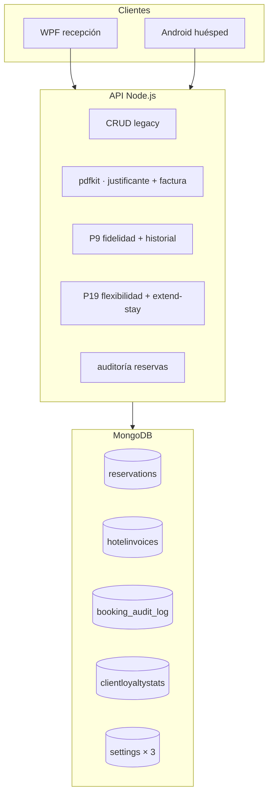

# API — Novedades (Proyecto Individual)

Extensión de la API del proyecto intermodular (Ysael, Pau, David). El núcleo original —auth JWT, usuarios, habitaciones, reservas, reseñas, Multer, correos de registro/recuperación— está documentado en la memoria del módulo; **este README solo describe lo añadido después**.

Clientes: [WPF](../WPF-Intermodular-Ysael/README.md) · [Android](../APP-Intermodular-Ysael/README.md)

---

## Resumen de cambios respecto a la memoria intermodular

| Área | Antes (memoria) | Ahora |
|------|-----------------|-------|
| Colecciones Mongo | 3 (`users`, `rooms`, `reservations`) | **11** (+ auditoría, facturas, fidelidad, catálogo extras, 3 documentos de configuración) |
| Reserva | Precio, fechas, cancelación | + checkout fiscal, justificante PDF, check-in recepción, P19 embebido, ampliación, `superseded_by` |
| Habitación | Una imagen, tipo, precio | + galería, oferta %, servicios extra, `isOperational`, ocupación en tiempo real |
| Facturación | No existía | PDF fiscal + justificante, `HotelInvoice` multi-concepto |
| Fidelidad | Descuento % en usuario | **P9** `ClientLoyaltyStats` (bronce/plata/oro) |
| Flexibilidad horaria | No existía | **P19** entrada anticipada / salida tardía (+ modo instalaciones) |
| Trazabilidad | No existía | **Auditoría** `booking_audit_log` (activable) |

---

## Arquitectura (capas nuevas)



---

## Puesta en marcha (variables nuevas)

Además de `MONGO_URI`, `PORT`, `JWT_SECRET` y `EMAIL_*` del proyecto base:

| Variable | Uso |
|----------|-----|
| `HOTEL_INVOICE_*`, `INVOICE_*` | Cabecera fiscal y numeración PDF |
| `INVOICE_IVA_RATE` | IVA en factura (default `0.10`) |
| `CHECK_IN_WINDOW_END_HOUR`, `CHECK_IN_LATE_FEE_EUR` | Check-in recepción |
| `FLEX_*`, `LOYALTY_*` | P19 y P9 (fallback si no hay doc en Mongo) |
| `BOOKING_AUDIT_ENABLED` | Auditoría por defecto |
| `CLIENT_FLEX_REQUEST_WINDOW_HOURS` | Ventana 12 h para cliente (late / ampl. corta) |

```bash
npm install && npm start
```

---

## Colecciones y modelos nuevos

| Colección | Modelo | Función |
|-----------|--------|---------|
| `booking_audit_log` | `BookingAuditLog` | Snapshots antes/después por cambio en reserva |
| `hotelinvoices` | `HotelInvoice` | Histórico facturas (`reservation`, `early_checkin`, `late_checkout`, `stay_extension`) |
| `clientloyaltystats` | `ClientLoyaltyStats` | Un doc por `user_id`: noches, gasto, rango |
| `extraservices` | `ExtraService` | Catálogo `EXT-xxx` con precio |
| `invoicesettings` | `InvoiceSettings` | Emisor PDF (override `.env`) |
| `flexibilitysettings` | `FlexibilitySettings` | €/h P19, auto-aprobación, notificaciones |
| `operationalsettings` | `OperationalSettings` | Auditoría on/off + ventana 12 h cliente |

**Ampliaciones en modelos existentes**

- **`Reservation`:** `invoice_number`, `checkout_completed_at`, `invoice_breakdown`, `reception_check_in_*`, `early_checkin_requested`, `late_checkout_requested`, `superseded_by_reservation_id`, `extended_from_reservation_id`
- **`Room`:** `images[]`, `extra_services[]`, `offer_active`, `offer_percent`, `isOperational`; respuesta API con `normalizeRoomOut` (`effective_price_per_night`, `is_occupied_now`, …)
- **`User`:** `billing_company_name`, `billing_company_cif` (bloque empresa en PDF)

---

## Auditoría de reservas

Registro automático (si `booking_audit_enabled`) en crear, actualizar, cancelar, checkout y check-in recepción.

- Middleware: `bookingAuditMiddleware.js` captura estado **antes**
- Servicio: `auditService.js` → `logBookingChange`, `describeReservationAuditChanges`
- Lectura: `GET /reservation/:id/audit`, `GET /reservation/audits` con `resumen_cambios` y `detalle_cambios` (antes/después por campo)
- Config: `GET/PUT /settings/operational`

---

## Facturación PDF

| Documento | Endpoint | Cuándo |
|-----------|----------|--------|
| Justificante (no fiscal) | `GET /reservation/:id/booking-receipt` | Tras reserva / pago simulado |
| Factura fiscal | `GET /reservation/:id/invoice` | Tras `POST /reservation/checkout` |

- Generación: **pdfkit** (`invoicePdfService.js`, `invoiceBreakdownService.js`)
- Checkout: asigna `invoice_number`, congela `invoice_breakdown`
- Emisión adicional: `HotelInvoice` vía `invoiceEmissionService` (P19, extend-stay, `confirm-payment`)
- Listados: `GET /invoices?userId=`, `GET /reservation/invoices/history`
- Reenvío email PDF: `POST /reservation/:id/invoice/email` (personal, requiere SMTP)
- Config emisor: `GET/PUT /settings/invoice`

---

## Check-in en recepción

Distinto de la fecha `check_in` de la reserva y de P19 “entrada anticipada”.

| Endpoint | Rol |
|----------|-----|
| `POST /reservation/check-in` | admin / employee |
| `GET /reservation/:id/check-in-status` | admin / employee |

Campos: `reception_check_in_at`, `reception_check_in_late`, `reception_check_in_late_fee`. Ventana día de entrada 12:00–22:00; fuera → recargo (`CHECK_IN_LATE_FEE_EUR`).

---

## P9 · Fidelidad e historial

| Endpoint | Descripción |
|----------|-------------|
| `GET /loyalty/me` | Recalcula y devuelve rango + métricas (cliente) |
| `POST /loyalty/me/sync` | Fuerza recálculo |
| `GET /loyalty/user/:userId` | Stats de un cliente (personal) |
| `GET /users/:id/history` | Historial estancias paginado |
| `GET /users/:id/stats` | Insights (temporada, habitación top, racha, …) |

Servicios: `clientLoyaltyStatsService.js`, `userStayService.js`.

---

## P19 · Flexibilidad horaria

Entrada **antes de 12:00** o salida **después de 11:00** el **mismo día** (no confundir con `extend-stay`).

| Endpoint | Uso |
|----------|-----|
| `PATCH /bookings/:id/request-early-checkin` | Solicitud entrada anticipada |
| `PATCH /bookings/:id/request-late-checkout` | Salida tardía (`late_mode`: habitación o `facilities`) |
| `GET /bookings/:id/flexibility` | Estado + preview tarifa |
| `GET /bookings/flexibility/pending` | Cola pendientes (bronce) |
| `PATCH /bookings/:id/flexibility/*/review` | Aprobar/rechazar (personal) |
| `GET/PUT /settings/flexibility` | €/h, descuentos por rango, auto-aprobación plata/oro |

Cliente: ventana **12 h** desde las 11:00 del día de salida (`operationalsettings`). Plata/oro → auto si hay hueco; bronce → `pending`. Suplemento → `HotelInvoice` si `final_fee > 0`.

---

## Ampliación de estancia (`extend-stay`)

| Endpoint | Descripción |
|----------|-------------|
| `PATCH /bookings/:id/extend-stay` | Nueva `check_out`; si conflicto → nueva RSV + `superseded_by_reservation_id` |

Tarifa: &lt;24 h → €/h P19; ≥1 día → noches × tarifa efectiva habitación. Factura `type: stay_extension`.

---

## Habitaciones (mejoras API)

- `GET /room/available` — filtros `guests`, `services` (IDs extra), fechas con alias snake_case
- `GET /room/one?id=` — detalle por query
- `GET/POST /room/extra-services` — catálogo global
- `normalizeRoomOut` en listados: galería unificada, precio con oferta, `is_operational`, `is_occupied_now`
- `GET /reservation/allActive` — incluye `room_image`, `guest_name`, `guest_dni`

---

## Estructura de archivos (solo novedades)

```
models/     BookingAuditLog, HotelInvoice, ClientLoyaltyStats, ExtraService,
            InvoiceSettings, FlexibilitySettings, OperationalSettings
services/   auditService, invoice*Service, clientLoyaltyStatsService,
            userStayService, stayExtensionService, flexibility*Service,
            receptionCheckInService, flexibilityInvoiceHelper
controllers/ auditController, invoiceController, loyaltyStatsController,
            userStayController, flexibilityController, stayExtensionController,
            flexibilitySettingsController, operationalSettingsController,
            invoiceSettingsController, extraServiceController
middleware/ bookingAuditMiddleware.js
routes/     bookingRoutes, loyaltyRoutes, invoiceRoutes, settingsRoutes, usersRoutes
```

---

## Endpoints nuevos (referencia rápida)

Ver tablas completas en secciones anteriores. Prefijos: `/reservation`, `/bookings`, `/loyalty`, `/users`, `/settings`, `/invoices`.

**Cancelación/actualización REST:** `DELETE /reservation/cancel/:id`, `PATCH /reservation/update` (sustituyen variantes legacy documentadas en memoria).
