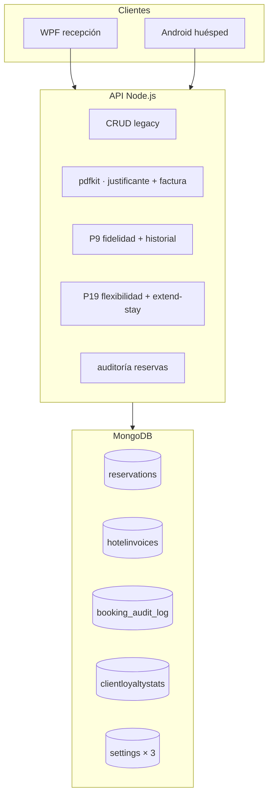

# API — Novedades (Proyecto Individual)

Extensión de la API del proyecto intermodular (Ysael, Pau, David). El núcleo original —auth JWT, usuarios, habitaciones, reservas, reseñas, Multer, correos de registro/recuperación— está documentado en la memoria del módulo; **este README solo describe lo añadido después**.

Clientes: [WPF](../WPF-Intermodular-Ysael/README.md) · [Android](../APP-Intermodular-Ysael/README.md)

---

## Resumen de cambios respecto a la memoria intermodular

| Área | Antes (memoria) | Ahora |
|------|-----------------|-------|
| Colecciones Mongo | 3 (`users`, `rooms`, `reservations`) | **11** (+ auditoría, facturas, fidelidad, catálogo extras, 3 documentos de configuración) |
| Reserva | Precio, fechas, cancelación | + checkout fiscal, justificante PDF, check-in recepción, P19 embebido, ampliación, `superseded_by` |
| Habitación | Una imagen, tipo, precio | + galería, oferta %, servicios extra, `isOperational`, ocupación en tiempo real |
| Facturación | No existía | PDF fiscal + justificante, `HotelInvoice` multi-concepto |
| Fidelidad | Descuento % en usuario | **P9** `ClientLoyaltyStats` (bronce/plata/oro) |
| Flexibilidad horaria | No existía | **P19** entrada anticipada / salida tardía (+ modo instalaciones) |
| Trazabilidad | No existía | **Auditoría** `booking_audit_log` (activable) |

---

## Arquitectura (capas nuevas)



---

## Puesta en marcha (variables nuevas)

Además de `MONGO_URI`, `PORT`, `JWT_SECRET` y `EMAIL_*` del proyecto base:

| Variable | Uso |
|----------|-----|
| `HOTEL_INVOICE_*`, `INVOICE_*` | Cabecera fiscal y numeración PDF |
| `INVOICE_IVA_RATE` | IVA en factura (default `0.10`) |
| `CHECK_IN_WINDOW_END_HOUR`, `CHECK_IN_LATE_FEE_EUR` | Check-in recepción |
| `FLEX_*`, `LOYALTY_*` | P19 y P9 (fallback si no hay doc en Mongo) |
| `BOOKING_AUDIT_ENABLED` | Auditoría por defecto |
| `CLIENT_FLEX_REQUEST_WINDOW_HOURS` | Ventana 12 h para cliente (late / ampl. corta) |

```bash
npm install && npm start
```

---

## Colecciones y modelos nuevos

| Colección | Modelo | Función |
|-----------|--------|---------|
| `booking_audit_log` | `BookingAuditLog` | Snapshots antes/después por cambio en reserva |
| `hotelinvoices` | `HotelInvoice` | Histórico facturas (`reservation`, `early_checkin`, `late_checkout`, `stay_extension`) |
| `clientloyaltystats` | `ClientLoyaltyStats` | Un doc por `user_id`: noches, gasto, rango |
| `extraservices` | `ExtraService` | Catálogo `EXT-xxx` con precio |
| `invoicesettings` | `InvoiceSettings` | Emisor PDF (override `.env`) |
| `flexibilitysettings` | `FlexibilitySettings` | €/h P19, auto-aprobación, notificaciones |
| `operationalsettings` | `OperationalSettings` | Auditoría on/off + ventana 12 h cliente |

**Ampliaciones en modelos existentes**

- **`Reservation`:** `invoice_number`, `checkout_completed_at`, `invoice_breakdown`, `reception_check_in_*`, `early_checkin_requested`, `late_checkout_requested`, `superseded_by_reservation_id`, `extended_from_reservation_id`
- **`Room`:** `images[]`, `extra_services[]`, `offer_active`, `offer_percent`, `isOperational`; respuesta API con `normalizeRoomOut` (`effective_price_per_night`, `is_occupied_now`, …)
- **`User`:** `billing_company_name`, `billing_company_cif` (bloque empresa en PDF)

---

## Endpoints nuevos (detalle)

Todas las rutas nuevas exigen **JWT** salvo que se indique lo contrario. `:id` = `reservation_id` (`RSV-xxxxx`).

---

### Verbos REST en reservas (mejora sobre memoria)

La memoria solo documentaba `POST /cancel` y actualización genérica. Ahora el contrato es más claro para clientes modernos.

| Método | Ruta | Función |
|--------|------|---------|
| `PATCH` | `/reservation/update` | Actualiza parcialmente una reserva (habitación, fechas, cliente, precio). Valida reglas de negocio (no canceladas/vencidas, etc.). Si auditoría activa, guarda snapshot antes/después. |
| `DELETE` | `/reservation/cancel/:reservation_id` | Cancela por ID en URL. El precio de penalización va en query `?price=`. Equivalente a `POST /cancel` con body. |

---

### Auditoría de reservas

**Para qué sirve:** trazabilidad de quién cambió qué en cada reserva (recepción, caja, sistema). Solo lectura en API; la escritura es automática al guardar cambios.

| Método | Ruta | Quién | Función |
|--------|------|-------|---------|
| `GET` | `/reservation/:reservation_id/audit` | Dueño de la reserva o admin/empleado | Devuelve la línea de tiempo de esa reserva: cada evento con `action` (`CREATED`, `UPDATED`, `CANCELED`), actor, fecha y **`resumen_cambios`** / **`detalle_cambios`** (valor antes y después por campo). |
| `GET` | `/reservation/audits` | admin / empleado | Listado global de eventos de auditoría (misma forma enriquecida). Usado por WPF en pantalla «Auditorías». |

**Escritura automática** (si `booking_audit_enabled`): alta (`POST /add`), cancelación, `PATCH /update`, checkout y check-in recepción. El middleware `bookingAuditMiddleware` lee el documento **antes**; tras éxito, `auditService.logBookingChange` inserta en `booking_audit_log`.

---

### Facturación, PDF y pagos simulados

**Para qué sirve:** dar al huésped un comprobante al reservar y, al cerrar la estancia en recepción, una factura numerada con desglose fiscal. Las emisiones quedan también en `hotelinvoices`.

| Método | Ruta | Quién | Función |
|--------|------|-------|---------|
| `POST` | `/reservation/checkout` | admin / empleado | Cierra la estancia en caja: comprueba que `check_out` ya pasó, genera **`invoice_number`** único, calcula y congela **`invoice_breakdown`** (noches, oferta habitación, dto cliente, extras, IVA). No genera archivo en disco; los datos quedan en Mongo para el PDF. |
| `GET` | `/reservation/:id/billing-info` | Dueño o personal | JSON informativo: pasarela **ficticia**, rutas relativas para descargar justificante y factura (si existe). Las apps lo usan para mostrar botones sin hardcodear URLs. |
| `GET` | `/reservation/:id/booking-receipt` | Dueño o personal | Genera al vuelo un **PDF justificante** (no fiscal) con datos de reserva e importe TTC. Disponible en cuanto existe la reserva; no requiere checkout. |
| `GET` | `/reservation/:id/invoice` | Dueño o personal | Genera el **PDF factura fiscal** a partir de `invoice_number` y desglose guardados. Query opcional `?invoice_number=FAC-…` si hay varias facturas por la misma reserva. Responde error si aún no hubo checkout. |
| `POST` | `/reservation/:id/confirm-payment` | Dueño o personal | Tras el «pago simulado» en la app: crea registro en **`HotelInvoice`** (`type: reservation`) de forma idempotente. No sustituye al checkout de recepción para la factura fiscal principal. |
| `POST` | `/reservation/:id/invoice/email` | admin / empleado | Regenera el PDF y lo envía por **SMTP** al email del cliente (body opcional `{ "to": "…" }`). Requiere `EMAIL_*` en `.env`. |
| `GET` | `/reservation/invoices/history` | admin / empleado | Lista todas las filas de **`HotelInvoice`** (estancia, P19, ampliación…). Sincroniza reservas antiguas sin factura al abrir el histórico. |
| `GET` | `/invoices?userId=CLI-xxxxx` | Cliente (solo su id) o personal | Facturas emitidas de un huésped desde la colección `hotelinvoices` (no solo el campo en `reservations`). Alimenta «Mis facturas» en Android. |

---

### Check-in en recepción

**Para qué sirve:** registrar la **llegada física** del huésped al mostrador. Es independiente de la fecha `check_in` de la reserva y de P19 (entrada anticipada).

| Método | Ruta | Quién | Función |
|--------|------|-------|---------|
| `GET` | `/reservation/:id/check-in-status` | admin / empleado | Indica si hoy es día de entrada, si ya se registró check-in, si está dentro de la ventana **12:00–22:00** y si aplicaría recargo por llegada tardía. |
| `POST` | `/reservation/check-in` | admin / empleado | Body: `{ "reservation_id": "RSV-…" }`. Guarda **`reception_check_in_at`**. Si llega fuera de ventana, marca tardío y suma **`reception_check_in_late_fee`** al `price` de la reserva. |

---

### P9 · Fidelidad (`/loyalty`)

**Para qué sirve:** calcular rango **bronce / plata / oro** según noches y gasto acumulado; ese rango alimenta descuentos en P19 (auto-aprobación y % sobre suplemento).

| Método | Ruta | Quién | Función |
|--------|------|-------|---------|
| `GET` | `/loyalty/me` | Cliente logueado | Recorre todas las reservas del usuario, actualiza **`ClientLoyaltyStats`** y devuelve `loyalty_tier`, `total_nights`, `total_spent`, estancias completadas, umbrales y resumen de reservas activas. |
| `POST` | `/loyalty/me/sync` | Cliente | Igual que `GET /me` pero pensado como «forzar recálculo» explícito. |
| `GET` | `/loyalty/user/:userId` | admin / empleado | Estadísticas de un cliente concreto. Query `?resync=0` lee caché sin recalcular. |

---

### P9 · Historial de estancias (`/users` y `/user`)

**Para qué sirve:** que recepción (WPF) y el huésped (Android) vean estancias **pasadas/completadas** con contexto de habitación y valoración, no solo reservas activas.

| Método | Ruta | Quién | Función |
|--------|------|-------|---------|
| `GET` | `/users/:id/history` | Dueño (`CLI-…`) o personal | Lista paginada de estancias terminadas. Query: `page`, `limit`, filtros de fecha. Cada ítem incluye datos de habitación y reseña si existe. |
| `GET` | `/users/:id/stats` | Igual | Agregados enriquecidos: temporada favorita, habitación más usada, racha de estancias, totales, etc. |
| `GET` | `/user/:userId/history` | Igual | **Alias** de la fila anterior (mismo handler). |
| `GET` | `/user/:userId/stats` | Igual | **Alias** de stats. |

---

### P19 · Flexibilidad horaria

**Para qué sirve:** permitir entrar **antes de las 12:00** o salir **después de las 11:00** el **mismo día** de entrada/salida de la reserva, con suplemento por horas y reglas según fidelidad. **No** amplía noches (eso es `extend-stay`).

Prefijo canónico: **`/bookings/:id`** (`id` = `RSV-xxxxx`). Existen **alias** bajo `/reservation/:reservation_id/…` con los mismos handlers.

| Método | Ruta | Quién | Función |
|--------|------|-------|---------|
| `GET` | `/bookings/:id/flexibility` | Dueño o personal | Estado actual de solicitudes early/late, rango del cliente, reglas de auto-aprobación y **`fee_preview`** (tarifa estimada antes de confirmar). |
| `PATCH` | `/bookings/:id/request-early-checkin` | Dueño o personal | Body: `{ "requested_time": "ISO" }`. Pide entrada antes de las 12:00 el día de `check_in`. Comprueba hueco en habitación, aplica €/h y rango; plata/oro pueden quedar `approved` al instante; bronce → `pending`. |
| `PATCH` | `/bookings/:id/request-late-checkout` | Dueño o personal | Body: hora y opcional `"mode": "facilities"` (salida tardía sin ocupar habitación, hasta tope configurado). Solo mismo día que `check_out`. Cliente: limitado a **12 h** tras las 11:00. |
| `GET` | `/bookings/flexibility/pending` | admin / empleado | Cola del día con solicitudes en `pending` (típico bronce) para la pantalla de recepción. Query `?day=YYYY-MM-DD`. |
| `PATCH` | `/bookings/:id/flexibility/early-checkin/review` | admin / empleado | Body: aprobar/rechazar + nota. **Revalida** disponibilidad al aprobar. Actualiza `check_in`, `price` y puede emitir `HotelInvoice` si hay cargo. |
| `PATCH` | `/bookings/:id/flexibility/late-checkout/review` | admin / empleado | Igual para salida tardía. |

**Legacy (misma lógica):** `POST /reservation/:id/flexibility/early-checkin`, `PATCH /reservation/:id/request-early-checkin`, etc.

**Tras aprobar con cargo:** email al cliente (si SMTP y `notify_client_on_decision`) y factura en `hotelinvoices` (`early_checkin` / `late_checkout`).

---

### Ampliación de estancia (`extend-stay`)

**Para qué sirve:** alargar la salida **más allá del mismo día** (noches extra u horas con nueva fecha). Si la habitación está ocupada en el tramo nuevo, crea **otra reserva** y enlaza la anterior con `superseded_by_reservation_id` (no es cancelación).

| Método | Ruta | Quién | Función |
|--------|------|-------|---------|
| `PATCH` | `/bookings/:id/extend-stay` | Dueño o personal | Body: `{ "new_check_out": "fecha o ISO" }`. Calcula suplemento: &lt;24 h → tarifa horaria P19; ≥1 día → noches × precio efectivo habitación. Emite `HotelInvoice` `stay_extension`. Cliente: misma ventana 12 h que late checkout para ampliaciones cortas el día de salida. |

---

### Configuración del hotel (`/settings`)

**Para qué sirve:** persistir en Mongo reglas que antes solo vivían en `.env`, editables desde WPF sin redeploy.

| Método | Ruta | Quién | Función |
|--------|------|-------|---------|
| `GET` | `/settings/invoice` | admin / empleado | Lee datos fiscales del emisor (nombre, CIF, dirección, notas, IVA) fusionando documento único `InvoiceSettings` + fallback `.env`. |
| `PUT` | `/settings/invoice` | admin / empleado | Guarda overrides para el encabezado del PDF de factura. |
| `GET` | `/settings/flexibility` | admin / empleado | Tarifas €/h early/late, mínimos de horas, topes, descuentos por rango, flags de auto-aprobación y email. |
| `PUT` | `/settings/flexibility` | admin / empleado | Actualiza reglas P19 (pantalla «Reglas solicitudes» en WPF). |
| `GET` | `/settings/operational` | admin / empleado | Lee si la auditoría está activa y las horas de ventana cliente para flexibilidad. |
| `PUT` | `/settings/operational` | admin / empleado | Body: `{ "booking_audit_enabled": true/false, "client_flex_request_window_hours": 12 }`. Desactivar auditoría deja de insertar en `booking_audit_log` sin borrar histórico. |

---

### Habitaciones y catálogo de extras

**Para qué sirve:** búsqueda tipo booking (filtros, galería, ofertas) y extras facturables compartidos entre habitaciones.

| Método | Ruta | Función |
|--------|------|---------|
| `GET` | `/room/one?id=HAB-xxx` | Detalle por **query** (recomendado para GET desde Retrofit/HttpClient). Devuelve habitación con `normalizeRoomOut` (galería, precio efectivo con oferta, flags operativa/ocupada). |
| `GET` | `/room/available?checkIn=&checkOut=&guests=&services=` | Habitaciones libres en el rango. Excluye no operativas, sin capacidad y con solapamiento de reservas. `services` = IDs `EXT-xxx` separados por comas (la habitación debe tener **todos**). Acepta alias `check_in`, `check_out`, `service_ids`. |
| `GET` | `/room/extra-services` | Lista servicios extra activos del catálogo (`EXT-001`, nombre, precio). |
| `POST` | `/room/extra-services` | Crea servicio nuevo; body `{ "name": "…", "price": 0 }`. El servidor asigna el siguiente `EXT-xxx`. |
| `GET` | `/room/all` (respuesta enriquecida) | Misma ruta de la memoria, pero cada ítem incluye `images`, `effective_price_per_night`, `is_operational`, `is_occupied_now`, etc. |

---

### Reservas enriquecidas (misma ruta, más datos)

| Método | Ruta | Función |
|--------|------|---------|
| `GET` | `/reservation/mine` | Solo reservas **activas** del cliente: sin `cancelation_date` y sin `superseded_by_reservation_id` (oculta RSV sustituidas por ampliación con cambio de habitación). |
| `GET` | `/reservation/allActive` | Para panel WPF: reservas activas con **`room_image`**, **`guest_name`**, **`guest_dni`** para tarjetas de check-in sin peticiones extra. |
| `POST` | `/reservation/getPrice` | Calcula precio usando **precio nocturno con oferta** de la habitación (alineado con catálogo), más descuento del perfil cliente sobre alojamiento. |

---

## Estructura de archivos (solo novedades)

```
models/     BookingAuditLog, HotelInvoice, ClientLoyaltyStats, ExtraService,
            InvoiceSettings, FlexibilitySettings, OperationalSettings
services/   auditService, invoice*Service, clientLoyaltyStatsService,
            userStayService, stayExtensionService, flexibility*Service,
            receptionCheckInService, flexibilityInvoiceHelper
controllers/ auditController, invoiceController, loyaltyStatsController,
            userStayController, flexibilityController, stayExtensionController,
            flexibilitySettingsController, operationalSettingsController,
            invoiceSettingsController, extraServiceController
middleware/ bookingAuditMiddleware.js
routes/     bookingRoutes, loyaltyRoutes, invoiceRoutes, settingsRoutes, usersRoutes
```

